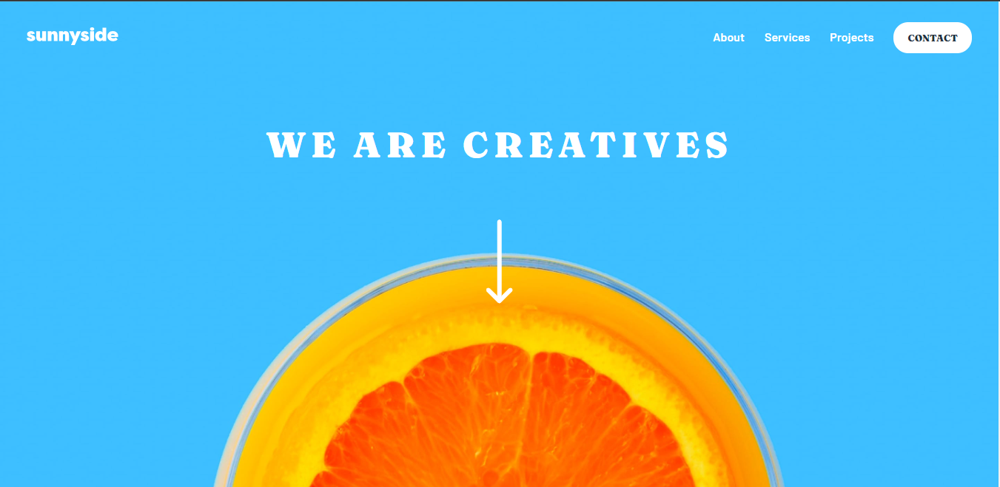

# Frontend Mentor - Sunnyside agency landing page

This is a solution to the [Sunnyside agency landing page challenge on Frontend Mentor](https://www.frontendmentor.io/challenges/sunnyside-agency-landing-page-7yVs3B6ef). Frontend Mentor challenges help you improve your coding skills by building realistic projects.

## Table of contents

- [Overview](#overview)
  - [The challenge](#the-challenge)
  - [Screenshot](#screenshot)
  - [Links](#links)
- [My process](#my-process)
  - [Built with](#built-with)
  - [What I learned](#what-i-learned)
  - [Continued development](#continued-development)
  - [Useful resources](#useful-resources)
- [Author](#author)
- [Acknowledgments](#acknowledgments)

**Note: Delete this note and update the table of contents based on what sections you keep.**

## Overview

### The challenge

Users should be able to:

- View the optimal layout for the site depending on their device's screen size
- See hover states for all interactive elements on the page

### Screenshot

### Links

- Solution URL: [Solution URL here](https://github.com/Khemmie-Ray/Sunnyside-agency-landing-page.git)
- Live Site URL: [Live site URL here](https://khemmie-ray.github.io/Sunnyside-agency-landing-page/)

## My process

### Built with

- HTML5 
- CSS custom properties
- CSS flex

### What I learned
I learnt other styling options for the hamburger menu.

### Continued development

I intend to focus on the styling of the hamburger menu because it took a while before I understood how to achieve the background. Also the responsiveness of background images.

### Useful resources

- [Example resource 1](https://www.w3school.com) - This helped me with the learning of a mobile nav. I really liked this pattern and will use it going forward.

## Author

- Frontend Mentor - [@Khemmie-Ray](https://www.frontendmentor.io/profile/Khemmie-Ray)

## Acknowledgments

Thank you.

